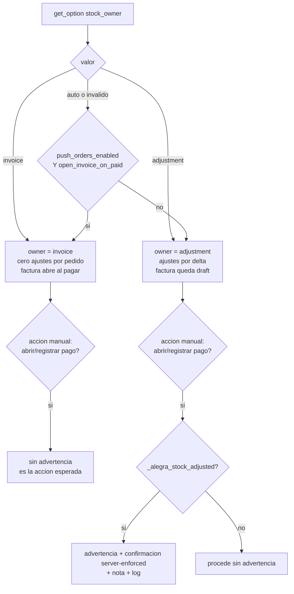

# Diseño Técnico — Propiedad única del stock, poll honesto, cola de facturas y reconciliación (`stock-ownership`)

| Campo | Valor |
|---|---|
| Cambio | `stock-ownership` (dueño único de stock configurable + poll sin re-inflación + cola de facturas fallidas + reconciliación WC↔Alegra) |
| Documento base | `docs/sdd/stock-ownership/proposal.md` · `spec.md` (31 REQ, 104 escenarios) |
| Versión analizada | **2.6.0** (`alegra-connector.php:6`) |
| Versión objetivo | **2.7.0** (opciones nuevas + cambios de comportamiento ⇒ minor) |
| Naturaleza | Diseño técnico (no implementación) |
| Regla | Toda decisión nombra archivo, método y opción; lo no verificado es **SIN VERIFICAR / BLOQUEADO** |
| Relación | Consume `sync-reliability` (REQ-INV-07/08, dueño a nivel tienda, guarda de poll) y `inventory`; **corrige** lo que quedó a medias y **descarta** `Stock_Order_Context` (G9 refutado) |

> Este diseño es **cerrado**: dos desarrolladores implementan lo mismo. Donde hay elección, está
> tomada y justificada. Donde depende de Fase 0, se declaran las ramas y el punto exacto de
> bifurcación. **Cada cita `archivo:línea` fue re-verificada leyendo el código en HEAD**; las
> correcciones van en §0.

---

## 0. Correcciones de cita y de lógica (re-verificadas en HEAD)

La spec ya corrigió varias citas. Al re-leer el código aparecen **una corrección de lógica crítica**,
**dos citas desactualizadas del harness** y **una inconsistencia interna de la spec**. `tasks.md` las
consume.

| # | Claim de la propuesta/spec | Realidad verificada en HEAD | Impacto |
|---|---|---|---|
| **C1** | **`auto` = `invoice` si `push_orders_enabled`, si no `adjustment`** (`proposal.md:168-169`, `spec.md:173`, y el propio pedido de diseño). | **FALSO para compatibilidad total.** La lógica real de 2.6.0 es `push_orders_enabled && open_invoice_on_paid ? invoice : adjustment` (`Inventory_Pusher.php:87-90`). Con `push_orders_enabled=true` + `open_invoice_on_paid=false`, la fórmula simplificada devuelve `invoice` y **reintroduce el defecto B3/Oracle#1**: cero ajustes y factura que no mueve stock ⇒ **ningún mecanismo mueve stock**. | **CRÍTICO.** `auto` DEBE reproducir la **condición doble**. Ver §2.1 y §7.1. Corrige `proposal.md:168-169` y `spec.md:173`. |
| **C2** | `Inventory_Pusher.php:170-173` (Guard 2) y `:172` (`invoice_owner`) | **Confirmado.** `:171-173` es el `if`, `:172` el `return`. | Exacto. |
| **C3** | `Inventory_Pusher.php:197-216` (baseline FIX-1), `:214` (`set_synced`), `:244`, `:271` | **Confirmado.** `:214` = baseline; `:244` = `already_applied`; `:271` = `ok`. | Exacto. |
| **C4** | `Inventory_Pusher.php:303-335` (pre-chequeo sin `reference`) y `:340-358` (payload sin `reference`) | **Confirmado.** `adjustment_already_exists()` matchea `item+type+quantity` (`:317-332`); `build_adjustment_payload()` no emite `reference` (`:342-350`). | Exacto. Es REQ-POLL-06. |
| **C5** | `Products.php:1348-1349` (`$handled` **sin** `invoice_owner`) | **Confirmado.** La lista real es `['ok','already_applied','in_sync','api_error','blocked','locked','baseline_unverified']`. `invoice_owner` **no está** ⇒ el poll **cae al writer** y pisa WC con el valor de Alegra. La refutación de `ANALYSIS-all-invoiced-model.md:117` es **correcta**. | Exacto. Es REQ-POLL-03. |
| **C6** | `Products.php:1332-1334` (`needs_reconcile`) | **Confirmado.** `$needs_reconcile = manage_stock && (pending!=='' \|\| (synced!=='' && WC!=synced))`. Con `synced=''` y `pending=''` ⇒ `false` ⇒ el poll escribe Alegra→WC sin baseline (Escenario C). | Exacto. Es REQ-POLL-01/04. |
| **C7** | `Products.php:2274-2276` (W1 delega en `Inventory_Writer`, no setea ledger) | **Confirmado.** `apply_inventory_to_product()` en `:2274`; `Inventory_Writer::apply()` en `:2276`; **no** hay `set_synced`. | Exacto. Es REQ-POLL-01. |
| **C8** | `Products.php:1701,1823` (`set_syncing` del import) | **Confirmado.** No son `:1542`/`:1632`. | Corrige `ANALYSIS-double-discount.md:117`. |
| **C9** | `Orders.php:494` / `:512` (`create_invoice_with_payment` pasa `'open'`) | **Confirmado.** Declaración `:494`; el `'open'` se pasa en `:512`. | Exacto. |
| **C10** | `Orders.php:526` (`record_payment` descarta retorno) | **Confirmado.** La llamada no se asigna. | Exacto. |
| **C11** | `Orders.php:82-107` (guard `_alegra_invoice_id` + FIX-3) y `:88-101` (abrir borrador) | **Confirmado.** El early-return con apertura de borrador está en `:84-107`. | Exacto. |
| **C12** | `Orders.php:309-340` (pre-búsqueda AC-14) y llamada `:133-153` | **Confirmado.** `find_existing_invoice()` `:309-340` (cierra en `:340`); la llamada en `:138`. | Exacto. |
| **C13** | `Orders.php:850-913` (`ensure_invoice_open`) | **Confirmado.** Declaración `:850`; cierra `:913`. | Exacto. |
| **C14** | `Admin_Dashboard.php:2845-2895` (`ajax_open_invoice_impl`) y `:2897-3028` (`ajax_record_payment`) | **Confirmado.** `ajax_open_invoice_impl` `:2845-2895`; el wrapper público `ajax_record_payment` `:2897`, la `_impl` `:2902-3028`. **Ninguna** consulta `owner()`. | Exacto. Es REQ-OWN-06. |
| **C15** | `Admin_Dashboard.php:862-887` y gate `:903-905` | **Confirmado.** `get_unjournaled_sales()` `:862-887`; el gate invertido en `:903-905`. | Exacto. Es REQ-RECON-02. |
| **C16** | `Controller.php:86` (`run_payment_reconcile`) / `:72-74` (registro) | **Confirmado.** Declaración `:86`; registro `:72-74`. | Exacto. |
| **C17** | `Controller.php:298-305` (sólo poll inbound) | **Confirmado.** Es `poll_invoice_statuses()`; **no** hay sweep outbound de facturas. | Exacto. Es REQ-QUEUE-06. |
| **C18** | `Public_.php:406-422` (nota + log del fallo automático) | **Confirmado.** Nota `:409-413`; log `:415-421`, dentro de `trigger_sync()` `:373`. | Exacto. |
| **C19** | `Logger.php:198-241` (patrón option-backed) | **Confirmado.** `update_option('...logger_write_failed')` `:204`; `render_write_failure_notice()` `:224-241`. | Exacto. Es el molde de REQ-QUEUE-07. |
| **C20** | `Write_Gate.php:156` (`run_explicit`), `:182` (`maybe_migrate`) | **Confirmado.** | Exacto. |
| **C21** | `State_Sync.php:488` (`render_admin_notices`) | **Confirmado.** `queue_admin_notice()` es **`private`** (`:473`); el render es `public static` (`:488`). | Requiere exponer el queue (§4.7). |
| **C22** | `alegra-connector.php:414-468` (`$defaults`), `:507-513` (loop), `:460` (`open_invoice_on_paid`), `:462` (`invoice_status`) | **Confirmado.** No existen `stock_owner`, `invoice_retry_*` ni `_alegra_invoice_sync_state`. | Exacto. |
| **C23** | `.distignore:15` excluye `scripts/` | **Confirmado.** Además `:17` excluye `tests/` y `:32` excluye `docs/`. | Exacto. |
| **C24** | `design.md:873-878` (guarda de dueño del poll, **no implementada**) | **Confirmado.** La guarda `owner==='invoice' && $a !== $w ⇒ continue` está en el diseño y **no** en `Products.php:1327-1401`. | Exacto. Es REQ-POLL-03. |
| **C25** | **Harness H1:** `wc_update_product_stock()` "ausente de `wp-stubs.php`" (`sync-reliability/design.md:1388`) | **DESACTUALIZADO.** El stub **existe**: `wp-stubs.php:1489-1504` (setea stock, deriva status, dispara hooks). | Corrige el gap H1. D5 no necesita crearlo. |
| **C26** | **Harness H4:** "Sin ruta `/inventory-adjustments`" en el mock (`sync-reliability/design.md:1391`) | **DESACTUALIZADO.** La ruta **existe** y **aplica el delta** al `availableQuantity`: validador `alegra-mock.php:614-637`, `POST` `:880-914` (aplica en `:896`), `GET` con filtro `item_id` `:765-782`. | Corrige el gap H4. Falta: modelo de stock por **factura** y filtro por **`reference`**. D5. |
| **C27** | `ANALYSIS-all-invoiced-model.md:117,139` (Clave 1: `invoice_owner` en `$handled`) | **REFUTADO (la propuesta acierta).** Ver C5. El síntoma real es **re-inflación**, no starvation. La starvation es el riesgo que **crearía** el fix si se agrega `invoice_owner` al set sin el baseline de §3.5. | Cierra el fork del análisis. |
| **C28** | `spec.md:322-324` (REQ-OWN-06: "NO DEBE bloquear") vs `spec.md:1278` (§G FORK: Rama A advertir / Rama B bloquear) | **Inconsistencia interna.** El cuerpo del requerimiento fija el **resultado** (advertir + confirmar, no bloquear); la §G lo trataba como fork. | El diseño **honra el cuerpo** (advertir + confirmar server-enforced) y resuelve el **mecanismo**. Ver §2.2. `spec.md` §G corregida: ya no es fork. |
| **C29** | `T3.4` lee `get_option('alegra_connector_inventory_reference_filter', true)` | **Opción no sembrada.** No está en las 8 opciones de §10 ni en `uninstall.php`; y G3 es decisión de build, no de runtime. | **No se agrega opción.** Se reemplaza por la constante `Inventory_Pusher::USE_REFERENCE_FILTER` fijada por G3. Ver §3.6 y §9. El conteo queda en **8** opciones. |

**Hechos confirmados por grep en producción (excluye `scripts/`, `docs/`):**

- `alegra_connector_stock_owner` → **0 coincidencias**.
- `_alegra_invoice_sync_state` → **0 coincidencias**.
- `_alegra_stock_adjusted` → **0 coincidencias**.
- `Stock_Order_Context` / `woocommerce_reduce_order_stock` / `woocommerce_restore_order_stock` → **0 coincidencias**.
- `wp_mail` → **0 coincidencias** en `includes/`, `admin/`, `public/`; y **0 en `scripts/lib/wp-stubs.php`** (no hay stub).
- `alegra_connector_invoice_retry` → **0 coincidencias** (no existe el cron).

**Sin verificación posible en este repo (marcado `SIN VERIFICAR`):**

- **G1:** ¿una factura `draft` mueve stock, y `open` sí? (`phase0-results.md:12`, `PENDING-LIVE`).
- **G2:** forma del error de stock de Alegra (400 vs 422; `response.errors`).
- **G3:** ¿`GET /inventory-adjustments` soporta filtro `reference`? (el mock **no** lo soporta: `alegra-mock.php:765-782`).
- **G5:** ¿se pueden enumerar los ajustes por ítem en la cuenta viva? (`GET /inventory-adjustments?item_id=`, el mock sí lo hace).

---

## 1. Arquitectura

### 1.1 Principios

1. **Un solo dueño por movimiento (REQ-INV-08).** El dueño es una **decisión de tienda**
   (`alegra_connector_stock_owner`), resuelta en **un solo lugar** (`Inventory_Pusher::owner()`), no un
   accidente del orden de hooks de WC (G9 refutado).
2. **Un solo escritor de stock WC.** `Inventory_Writer::apply()` sigue siendo el único punto que llama
   `wc_update_product_stock()` (ya existe, `Inventory_Writer.php:39`).
3. **El poll no se apaga.** La dirección Alegra→WC (POS, ediciones manuales) se conserva con
   presupuesto, cursor y `truncated` de 2.6.0. Se le agrega **conciencia de dueño**.
4. **El poll nunca re-infla y nunca se muere de hambre.** El `continue` sólo se usa cuando hay un
   cambio local sin empujar que **no** se pudo empujar. Si no hay cambio local, el poll baja Alegra.
5. **La ausencia de dato no es cero.** `availableQuantity` null/'' ⇒ SKIP, nunca 0.
6. **Fail-loud.** Todo fallo de factura deja señal durable: ledger + pantalla + badge + aviso. Cero
   silencios (incluidos los bloqueos de `Write_Gate`, hoy mudos en el nivel del pedido).
7. **Idempotencia antes de reintentar.** `_alegra_invoice_id`, `find_open_invoice_for_order`,
   `find_existing_invoice` (AC-14), lock por pedido, y **re-búsqueda post-error**.
8. **HPOS-safe.** Todo meta de pedido vía CRUD (`update_meta_data()`/`save()`), nunca SQL directo.
9. **Plugin distribuido.** Cero supuestos de host: sin cron real obligatorio (degrada a reintento
   manual), sin Action Scheduler, sin `set_time_limit` como defensa, sin orden de hooks de WC.

### 1.2 Componentes

```
┌───────────────────────────────────────────────────────────────────────────────┐
│                                Write_Gate                                     │
│  kill switch (duro) + entidad (invoice/credit_note/payment/inventory…) +       │
│  contexto explícito (run_explicit)                                             │
└───────────────────────────────┬───────────────────────────────────────────────┘
                                │ todo POST/PUT/PATCH/DELETE
                                ▼
┌───────────────┐   ┌───────────────────────────────┐   ┌────────────────────┐
│  admin/*      │   │            Sync\*             │   │    API\Client      │
│  Ajustes      │──▶│  Products / Orders / Ctrl     │──▶│  /invoices         │
│  Cola         │   │                               │   │  /inventory-adj.   │
│  Reconciliación│  │  ┌─────────────────────────┐  │   │  /items            │
└───────┬───────┘   │  │ Inventory_Pusher        │  │   └────────────────────┘
        │           │  │  owner() + ledger       │──┼───────────┘
        ▼           │  │  reference (idempot.)   │  │
┌───────────────┐   │  └───────────┬─────────────┘  │
│ Invoice_Failure│  │              │                │
│ (N) clasifica  │   │  ┌───────────▼─────────────┐  │
│   + ledger     │   │  │ Inventory_Writer (único)│  │
│ Invoice_Queue  │   │  │  escribe stock WC       │  │
│ (N) pantalla   │   │  └─────────────────────────┘  │
│ Stock_Divergence│  │  Products: poll + baseline    │
│ (N) informe    │   │  Orders: baseline factura     │
└───────────────┘   └───────────────────────────────┘
```

**Responsabilidades (nuevas):**

| Componente | Archivo | Responsabilidad |
|---|---|---|
| `Invoice_Failure` (N) | `includes/Sync/Invoice_Failure.php` | Clasificador puro + persistencia/limpieza del ledger de fallo. |
| `Invoice_Queue` (N) | `includes/Sync/Invoice_Queue.php` | Query paginada de la pantalla "Facturas por subir" + conteo cacheado (separa UI de dominio). |
| `Stock_Divergence` (N) | `includes/Sync/Stock_Divergence.php` | Detección de divergencia WC↔Alegra, causa, reparación explícita. |

### 1.3 Flujo D1 — la decisión de dueño



### 1.4 Flujo D2 — el poll + el ledger

```
POR ÍTEM DEL POLL
  A = item.inventory.availableQuantity   (null ⇒ servicio)
  W = product.get_stock_quantity()
  S = _alegra_stock_synced   ('' si nunca)
  P = _alegra_stock_push_pending ('' si no hay push en vuelo)
  owner = Inventory_Pusher::owner()

  (A) limpieza lazy de modo: owner=invoice && P!='' ⇒ clear_pending   ◀── REQ-OWN-05
  (B) clasificar estado:
      CONVERGED        = S!='' && P=='' && W==S
      NO_BASELINE_EQ   = S=='' && P=='' && A usable && W==A
      LOCAL_PENDING    = el resto
  (C) CONVERGED | NO_BASELINE_EQ
        si NO_BASELINE_EQ ⇒ set_synced(A)
        writer.apply(A)  → updated ⇒ set_synced(W), clear_pending
  (D) LOCAL_PENDING
        si can_push (adjustment && push_on && linked && manage_stock):
            si S=='' ⇒ baseline desde A (el poll ya la tiene; sin GET)
            push_delta(W, from_poll=true)
              ok|already_applied ⇒ cae al writer (A==W)
              in_sync            ⇒ cae al writer (Alegra cambió)
              otro               ⇒ divergencia, NO pisar WC, P queda
        si no (invoice / push off):
            si S=='' && A usable ⇒ set_synced(A)   (baseline pre-venta)
            divergencia, NO pisar WC
```

### 1.5 Flujo D3 — la cola de fallos

```
create_invoice() / create_invoice_with_payment()
   POST /invoices
   ├─ WP_Error ──▶ re-búsqueda post-error (find_existing_invoice)
   │                 ├─ encontrada ⇒ adoptar + persist_invoice_result (resolved)
   │                 └─ no         ⇒ Invoice_Failure::classify() ⇒ persist(ledger)
   ├─ bloqueado (Write_Gate / dry-run)
   │                 ├─ dry_run    ⇒ NO persistir
   │                 └─ gate       ⇒ persist(state=blocked)
   └─ éxito ────────▶ persist_invoice_result (resolved + limpia ledger + refresca count)

Pantalla "Facturas por subir"  ◀── wc_get_orders(meta_query ledger ∪ nunca-intentados)
   ├─ Reintentar (single) ──▶ Write_Gate::run_explicit → create_invoice_with_payment
   ├─ Reintentar seleccionados ──▶ chunked existente con scope=failed (10/request)
   └─ Cron horario (opt-in) ──▶ sólo failed_retriable + backoff + tope
```

### 1.6 Flujo D4 — la reconciliación

```
poll (durante su pasada, sin GET extra)
   por cada ítem donde NO pudo escribir WC (LOCAL_PENDING sin push, baseline no obtenible,
   locked, owner=invoice con factura pendiente) ⇒ registra {product_id, W, A, S, causa}
   en option alegra_connector_stock_divergence (bounded, autoload no)

Informe (dashboard + pantalla)
   lee la option + get_unjournaled_sales() des-invertido ⇒ lista con causa

Reparación explícita (Write_Gate::run_explicit)
   por producto: factura faltante (si hay pedido pagado sin factura) O ajuste correctivo
   por el delta ⇒ NUNCA ambos para el mismo movimiento (REQ-INV-08) + nota + log
```

---

## 2. D1 — El modelo de propiedad del stock (el fix del doble descuento)

### 2.1 La opción y la resolución (`owner()`)

**Opción nueva:** `alegra_connector_stock_owner` ∈ `{auto, invoice, adjustment}`, default **`auto`**,
autoload **no**.

```php
// includes/Sync/Inventory_Pusher.php — reemplaza :85-91
public static function owner(): string
{
    $mode = (string) get_option('alegra_connector_stock_owner', 'auto');

    if ($mode === 'invoice' || $mode === 'adjustment') {
        return $mode;
    }
    if ($mode !== 'auto') {
        // REQ-OWN-02 (borde): valor inválido ⇒ auto + warning (una vez por request).
        self::log_invalid_owner($mode);
    }

    // auto == lógica EXACTA de 2.6.0 (CORRECCIÓN C1: condición DOBLE).
    return (get_option('alegra_connector_push_orders_enabled', false)
        && get_option('alegra_connector_open_invoice_on_paid', true))
        ? 'invoice'
        : 'adjustment';
}
```

**Semántica:**

- `invoice` ⇒ dueño `invoice`: la factura de Alegra es el único motor de stock de las ventas; el plugin
  **no** emite ajustes para cambios originados en un pedido (Guard 2, `:171-173`).
- `adjustment` ⇒ dueño `adjustment`: el plugin empuja los deltas; la factura **no** auto-abre (queda
  `draft`).
- `auto` (default) ⇒ condición **doble** de 2.6.0 (CORRECCIÓN C1). Cero cambio de comportamiento.

**Por qué la condición doble y no `push_orders_enabled` solo (CORRECCIÓN C1):** con
`push_orders_enabled=true` + `open_invoice_on_paid=false`, la factura nace `draft` y **no mueve stock**
(`Orders.php:122-126` sólo aplica el override `'open'` si `owner()==='invoice'`). Si `auto` devolviera
`invoice`, el pusher no emitiría ajustes y la factura no movería stock ⇒ **ningún mecanismo mueve
stock** (defecto B3/Oracle#1 de `sync-reliability`). La condición doble garantiza que `invoice` sólo
se elige cuando la factura efectivamente mueve stock. **`proposal.md:168-169` y `spec.md:181-185` ya
codifican esta condición doble; el diseño la refleja sin divergencia.**

### 2.2 Cómo el doble descuento se vuelve imposible en CADA modo

| Modo | Mecanismo de stock | Por qué no hay doble descuento |
|---|---|---|
| **`invoice`** | La factura. | Guard 2 (`:171-173`) corta **todo** ajuste originado en un pedido **antes** del baseline/POST. Abrir la factura manualmente **no** es un segundo movimiento: nunca hubo un primer ajuste. **Imposible por construcción en los caminos del plugin.** La apertura desde la **UI/API de Alegra** no pasa por el plugin y **no** se puede prevenir: el poll la detecta y la reporta como divergencia (§5.1). |
| **`adjustment`** | El ajuste. | El plugin **nunca** auto-abre la factura: el override `'open'` de `create_invoice()` está gated por `owner()==='invoice'` (`Orders.php:122-126`), y `create_invoice_with_payment()` sólo pasa `'open'` si hay pago **y** el dueño es factura (§2.5). La factura queda `draft` (no mueve stock). La apertura **manual desde el plugin** es la única vía de doble conteo y está **guardada** (§2.2.1). La apertura desde la **UI/API de Alegra** queda fuera del alcance del plugin: la detecta el informe de divergencia (§5.1). |
| **`auto`** | Deriva a uno de los dos. | No agrega caminos. |

#### 2.2.1 La guarda de la apertura manual en `adjustment` (la decisión fuerte)

**Decisión: advertencia + confirmación **server-enforced** + nota + log. NO se bloquea; NO se deja la
factura draft-para-siempre.**

El plugin marca el pedido cuando emite un ajuste por él (meta `_alegra_stock_adjusted`, hoy inexistente
— F3 del análisis). Al abrir/registrar pago en modo `adjustment`:

1. `ajax_open_invoice_impl()` / `ajax_record_payment_impl()` resuelven `owner()`.
2. Si `owner()==='adjustment'` **y** el pedido tiene evidencia de ajuste emitido, exigen el
   parámetro POST `confirm_double_discount=1`. Sin él, responden `wp_send_json_error` con código
   **`double_discount_confirm_required`** y el texto de advertencia. El JS muestra el diálogo y
   reenvía con `confirm_double_discount=1`.
3. Con el flag, procede, deja **nota en el pedido** ("Apertura manual con ajuste ya emitido: el
   comerciante confirmó el doble descuento") y **log warning**.
4. Si `owner()==='invoice'` **o** el pedido **no** tiene ajuste emitido ⇒ procede sin advertencia
   (REQ-OWN-06: no molestar en modo factura).

**Por qué server-enforced y no un `confirm()` de JS:** un `confirm()` de cliente es un **paño de agua
tibia**: el AJAX puede llamarse directo y la confirmación no queda en ningún lado. Exigir el flag en el
servidor hace la acción **explícita, auditable y no salteable desde la UI del plugin** por un cliente
viejo/ausente. Sigue respetando el cuerpo de REQ-OWN-06 ("NO DEBE bloquear": con el flag, procede).
**Alcance real (honesto):** esta guarda cubre la apertura/registro **desde el panel de WP**. Abrir la
factura o registrar el pago desde la **UI/API de Alegra** no pasa por el plugin; para ese caso el poll
reporta la divergencia (§5.1), no la previene. La garantía "imposible" es del camino del plugin.

**Por qué la advertencia se muestra SÓLO si hay ajuste emitido:** si el pedido no tuvo ajuste
(producto no vinculado, push apagado, `manage_stock=no`), abrir la factura es **seguro** y no debe
advertir. Así la advertencia es **verdadera**, no ruido.

**Evidencia de ajuste emitido — forma:** el pusher escribe, en la rama `ok`/`already_applied` de
`push_delta()`, el meta **por producto** `_alegra_stock_adjusted_at` (timestamp) cuando no conoce el
pedido, y el meta **por pedido** `_alegra_stock_adjusted` (order id) cuando el flujo de pedido lo
provee. **Problema:** `push_delta` hoy no conoce el pedido (F1/`Stock_Order_Context` no existe y G9
refutó el orden de hooks). **Solución acotada y sin depender del orden de hooks:** la guarda manual
consulta, para cada línea del pedido, si alguno de sus productos tiene `_alegra_stock_adjusted_at`
**posterior a la creación del pedido**. Es O(líneas del pedido), no depende de hooks de pedido y cubre
el escenario del comerciante (ajuste al vender → apertura después).

> **BLOQUEADO(ON-VERIFICATION) — G1.** Si el `draft` **sí** mueve stock (Rama B de G1), la creación de
> la factura ya descuenta **antes** de la apertura manual ⇒ la guarda de apertura llega tarde. En esa
> rama, el modo `adjustment` **NO DEBE** crear la factura automáticamente: `create_invoice()` debe
> saltarse la creación cuando `owner()==='adjustment'` (la factura sólo se crea por acción manual
> explícita, y ahí la guarda sí aplica). Ver §13 (G1) y §12 (DR1).

### 2.3 La transición de modo (segura, sin migración masiva)

**Decisión: limpieza lazy y acotada desde el poll. Sin recorrer el catálogo, sin meta query.**

- Al guardar Ajustes, si `stock_owner` cambió, `update_option('alegra_connector_stock_owner_epoch', time(), false)`
  y se borran los conteos cacheados (badge/divergencia).
- El **poll**, en su pasada normal, si `owner()==='invoice'` **y** `pending !== ''`, hace
  `clear_pending($product_id)` (un `pending` en modo factura es basura de un modo anterior). Es O(ítems
  del poll), no una query por meta.
- El poll re-baselina `_alegra_stock_synced` según §3 (S==='' + W==A ⇒ set; S==='' + W!=A ⇒
  reconciliar/divergir).
- El dueño es **runtime**: el cambio surte efecto en el próximo movimiento (REQ-OWN-05).

**Por qué no limpiar en el `update_option`:** una query por `_alegra_stock_push_pending` en un catálogo
grande es exactamente el costo que NFR-04 prohíbe. La limpieza lazy es la única forma acotada.

### 2.4 El control del dashboard (copy exacto)

**Ubicación:** `templates/admin-settings.php`, sección inventario, **junto a** "Fuente de inventario"
(`:94`) y antes de "Enviar stock a Alegra" (`:101`).

```html
<tr><th>Dueño del stock:</th><td>
  <select name="alegra_connector_stock_owner">
    <option value="auto">Automático (recomendado)</option>
    <option value="invoice">Factura</option>
    <option value="adjustment">Ajuste</option>
  </select>
  <p class="description">
    Elegí UNO solo. Si elegís los dos, el stock se descuenta dos veces.
    <br><em>Dueño efectivo ahora: <strong>Factura|Ajuste</strong>.</em>
  </p>
</td></tr>
```

- La nota es **literal**: *"Elegí UNO solo. Si elegís los dos, el stock se descuenta dos veces."*
- Se muestra el **dueño efectivo** (resultado de `owner()`), para que "Automático" no sea ambiguo.
- Si se elige **Factura**, el toggle "Abrir la factura al pagarse" (`:110`) se **fuerza a ON** y se
  anota por qué (§2.5). Si se elige **Ajuste**, se muestra la advertencia de la apertura manual.
- El selector **no contradice** la sección existente: "Fuente de inventario" y "Sincronizar inventario"
  siguen siendo la dirección Alegra→WC; "Enviar stock a Alegra" sigue siendo el push WC→Alegra (que el
  dueño gobierna). El copy de `:105` se ajusta para referenciar el dueño.

### 2.5 Interacción con `push_orders_enabled` / `open_invoice_on_paid` / `invoice_status`

| Opción | Con `stock_owner=auto` | Con `stock_owner=invoice` | Con `stock_owner=adjustment` |
|---|---|---|---|
| `push_orders_enabled` | Decide `invoice` vs `adjustment` (junto con `open_invoice_on_paid`). | **Gobierna la auto-facturación.** Con `false`, el plugin **no** factura automáticamente (`Write_Gate.php:38-39` bloquea `invoice`; `Public_.php:49-59` no registra hooks de pedido) y Guard 2 corta los ajustes ⇒ **cero movimiento automático** (facturación manual). | Irrelevante para el stock; sigue gobernando la auto-facturación. |
| `open_invoice_on_paid` | **Parte de la condición** (compat total). | **Forzado ON**: el modo exige que la factura abra al pagar. La UI lo coerciona y lo anota. | **Forzado OFF**: el modo exige que la factura NO abra. |
| `invoice_status` | Sin cambio. Con `draft`, el borrador se abre al pagar (FIX-3, `Orders.php:88-101`). | **Recomendado `draft`**. Si es `open`, un pedido **impago** crea la factura abierta y mueve stock sin que WC haya reducido ⇒ divergencia hasta el pago; la UI advierte. | Sin efecto de stock: la factura queda `draft` por diseño. |

**Combinación `stock_owner=invoice` + `push_orders_enabled=false` ⇒ facturación manual (no doble
descuento).** Con el dueño en `invoice` pero el push de pedidos apagado, `Write_Gate` bloquea la entidad
`invoice` (`Write_Gate.php:38-39`) y `Public_` **no** registra los hooks de pedido (`Public_.php:49-59`);
Guard 2 corta todo ajuste (`Inventory_Pusher.php:170-173`). Resultado: **cero movimiento automático** —
no es doble descuento, pero tampoco "exactamente uno" automático. Se documenta como **facturación
manual**: el comerciante factura con "Facturar pendientes" (`Orders::sync_recent()`), y **recién ahí**
la factura (dueña) mueve el stock. La UI **DEBERÍA** advertir esta combinación al guardar; la coerción
de `open_invoice_on_paid` (§2.5) no alcanza porque el bloqueo es de la compuerta, no del estado de la
factura.

**Decisión sobre `open_invoice_on_paid` en modo `invoice` explícito:** `create_invoice()` abre el
borrador cuando `owner()==='invoice' && $order->is_paid()` (se **quita** la dependencia de
`get_option('alegra_connector_open_invoice_on_paid')` del `if` de `:88-90`; pasa a depender sólo del
dueño y del pago). El toggle se deshabilita en la UI con `stock_owner=invoice`. **Motivo:** dejar
`invoice` + `open_invoice_on_paid=false` produce el estado "ningún mecanismo mueve stock" (B3). Es la
misma clase de defecto que C1.

### 2.6 Alternativas evaluadas

| Alternativa | Por qué se rechaza |
|---|---|
| **A — Detectar "order-driven" por hooks** (`woocommerce_can_reduce_order_stock`) | Depende de un orden de hooks que **no existe** (G9 refutado por el core de WC: `ANALYSIS-double-discount.md` §3) y cambia el default de `adjustment`. Frágil y no distribuible. |
| **B — Guardas F1–F5 (`Stock_Order_Context` + Guard 6)** | El eslabón crítico (`Stock_Order_Context`) **no es implementable** como se diseñó; Guard 6 sólo cubre el orden factura-primero, y el comerciante factura **después**. Sólo advierte. |
| **C — Revertir el ajuste al abrir la factura** | Falla cuando la factura se abre **fuera de WC** (UI de Alegra): no hay hook. La reversión desde el plugin sólo cubriría el camino propio. Se descarta como mecanismo general (el análisis ya lo hizo). |
| **D — Dejar la factura `draft` para siempre** | Rompe el requisito de facturar (fiscal/contable). El comerciante necesita la factura emitida. |
| **E — Opción explícita de dueño** | **ELEGIDA.** Mínima, determinista, testeable, cero dependencias nuevas, compatibilidad total con `auto`. |

**Sobre "bloquear la apertura" (Rama B del fork de REQ-OWN-06):** se rechaza como *default* porque el
cuerpo del requerimiento fija el resultado ("NO DEBE bloquear: el comerciante decide") y porque
bloquear rompe la emisión de documentos para ventas legítimas. En su lugar, la confirmación
**server-enforced** con nota+log es la versión no-paño-de-agua-tibia de "advertir": la acción no se
puede saltear desde el cliente y queda auditada. **El fork se resuelve a favor del mecanismo fuerte
dentro de la rama "advertir".**

---

## 3. D2 — El arreglo del poll (NO apagarlo)

### 3.1 Los tres huecos (verificados contra HEAD)

| # | Hueco | Evidencia verificada | Fix |
|---|---|---|---|
| **B1** | El **import no fija** `_alegra_stock_synced`. Un producto importado y vendido antes del primer poll tiene `synced=''` ⇒ `needs_reconcile=false` ⇒ el poll escribe Alegra→WC y **re-infla**. | `set_synced` sólo en `Products.php:1378` y `Inventory_Pusher.php:214,244,271`; W1 (`Products.php:2274-2285`) **no** lo setea. `needs_reconcile` en `:1332-1334`. | §3.4 baseline en el import. |
| **B2** | **`invoice_owner` NO está en `$handled`** ⇒ el poll **cae al writer** y pisa WC con el valor de Alegra. | `Products.php:1348-1349` (lista real), `Inventory_Pusher.php:171-173` (Guard 2). El síntoma real es **re-inflación**, no starvation (CORRECCIÓN C27). | §3.3 rama `LOCAL_PENDING` no escribe WC. |
| **B3** | **Sin conciencia de dueño**: un `pending`/delta local se pisa con el valor de Alegra. | `Products.php:1327-1401` no consulta `owner()`. La guarda `design.md:873-878` **no** se implementó (CORRECCIÓN C24). | §3.3 + §3.5. |

**El "hueco" refutado:** `ANALYSIS-all-invoiced-model.md:117` afirmaba que `invoice_owner` **está** en
`$handled` y que el poll se congela (starvation). **Falso.** La lista real no lo incluye ⇒ el poll
**re-infla**. La propuesta acierta. **Consecuencia de diseño:** si el fix agregara `invoice_owner` al
set de "no escribir WC" **sin** el baseline de §3.5, **crearía** la starvation. Por eso ambos fixes van
juntos: sin §3.5, §3.3 congela; sin §3.3, §3.5 re-infla.

### 3.2 El ledger y la máquina de estados

**Metas por producto (sin cambio de nombres):**

| Meta | Tipo | Semántica |
|---|---|---|
| `_alegra_stock_synced` | int/'' | Último valor en el que **WC y Alegra acordaron**. Se fija **sólo** por: (a) push OK / `already_applied`; (b) pull del poll al escribir Alegra→WC; (c) **baseline del import** (§3.4); (d) **baseline de la factura** (§3.5). **Nunca** con un valor de WC sin push. |
| `_alegra_stock_push_pending` | int/'' | Valor de WC que se está empujando. Se setea antes del POST y se limpia al OK / `in_sync` / detección de idempotencia. |
| `_alegra_stock_adjusted_at` (N) | int (timestamp) | Marca de que el plugin emitió un ajuste para este producto. La lee la guarda manual (§2.2.1). |

**Estados (por ítem del poll):**

```
CONVERGED       = S!='' && P=='' && W==S
NO_BASELINE_EQ  = S=='' && P=='' && A usable && W==A
LOCAL_PENDING   = !CONVERGED && !NO_BASELINE_EQ
```

### 3.3 El algoritmo exacto (reemplazo de `Products.php:1327-1401`)

```php
$a_raw  = $item['inventory']['availableQuantity'] ?? null;
$has_a  = ($a_raw !== null && $a_raw !== '' && is_numeric($a_raw));
$a      = $has_a ? (int) $a_raw : null;

$w      = (int) $product->get_stock_quantity();
$s      = Inventory_Pusher::synced($product_id);      // int|''
$p      = Inventory_Pusher::pending($product_id);     // int|''

$owner   = Inventory_Pusher::owner();
$push_on = (bool) get_option('alegra_connector_push_inventory_enabled', true);
$linked  = (string) get_post_meta($product_id, '_alegra_item_id', true) !== '';
$manage  = $product->get_manage_stock();
$can_push = ($owner === 'adjustment') && $push_on && $linked && $manage;

// (A) REQ-OWN-05: limpieza lazy del pending de un modo anterior.
if ($owner === 'invoice' && $p !== '') {
    Inventory_Pusher::clear_pending($product_id);
    $p = '';
}

// (B) Clasificación del estado.
$converged      = ($s !== '' && $p === '' && $w === (int) $s);
$no_baseline_eq = ($s === '' && $p === '' && $has_a && $w === $a);
$local_pending  = (!$converged && !$no_baseline_eq);

if ($local_pending) {
    if ($can_push) {
        if ($s === '') {
            // FIX-1: baseline desde ALEGRA. El poll YA tiene A ⇒ sin GET extra.
            if (!$has_a) {
                $divergence++;                 // no se puede decidir; NO pisar WC
                continue;
            }
            Inventory_Pusher::set_synced($product_id, $a);
            $s = $a;
        }
        $push = (new Inventory_Pusher($this->api, $this->logger))
            ->push_delta($product, $w, true);

        if (in_array($push['reason'], ['ok', 'already_applied', 'in_sync'], true)) {
            // ok/already_applied ⇒ WC y Alegra acordaron (A == W).
            // in_sync            ⇒ W == S: no hay delta real; el poll puede bajar A.
            // En ambos casos cae al writer.
        } else {
            // api_error | blocked | locked | baseline_unverified
            //   | disabled | not_linked | not_manageable
            // Hay un cambio local sin empujar ⇒ NO pisar WC (se perdería la venta).
            $divergence++;
            continue;
        }
    } else {
        // owner=invoice (o push apagado): el cambio local no se puede empujar.
        if ($s === '' && $has_a) {
            Inventory_Pusher::set_synced($product_id, $a);   // baseline PRE-venta
        }
        // REQ-POLL-03/04: NO pisar WC; reportar divergencia.
        $divergence++;
        continue;
    }
} elseif ($no_baseline_eq) {
    // REQ-POLL-01: baselinar sin escribir de más (el writer es no-op).
    Inventory_Pusher::set_synced($product_id, $a);
}

// (C) Sin cambio local pendiente: el poll es dueño de la escritura WC.
//     Incluye owner=invoice DESPUÉS de que la factura movió stock y baselinó (§3.5).
if ($has_a) {
    set_transient('alegra_updating_product_' . $product_id, 1, 30);
    try {
        $status = (new Inventory_Writer($this->logger))->apply($product, $item, [
            'source'       => 'alegra',
            'preserve'     => in_array('inventory', $this->resolve_preserve_fields(), true),
            'manage_stock' => get_option('alegra_connector_inventory_manage_stock_enabled', false)
                                ? 'enable' : 'respect',
            'dry_run'      => (bool) get_option('alegra_connector_dry_run', false),
            'warehouse_id' => $this->resolve_warehouse_id(),
        ]);
        if ($status === 'updated' || $status === 'clamped_negative') {
            Inventory_Pusher::set_synced($product_id, (int) $product->get_stock_quantity());
            Inventory_Pusher::clear_pending($product_id);
            $result['updated']++;
        } elseif ($status === 'skipped_not_manageable') {
            $result['skipped_not_manageable']++;
        }
    } finally {
        delete_transient('alegra_updating_product_' . $product_id);
    }
}
```

**Diferencia clave con HEAD:** en HEAD, el `continue` de `:1350-1351` se dispara con **cualquier**
reason de `$handled`, y si el reason **no** está (p. ej. `invoice_owner`, `disabled`, `not_linked`) el
flujo **cae al writer**. En el diseño, el `continue` se dispara cuando el push **no** pudo manejar el
cambio local (`LOCAL_PENDING` + reason fuera de `ok|already_applied|in_sync`); `in_sync` **sí** cae al
writer. Así:

- `owner=invoice` + `LOCAL_PENDING` ⇒ divergencia, **no** pisa WC (REQ-POLL-03). Cierra B2.
- `owner=adjustment` + push fallido ⇒ divergencia, `pending` queda, **no** pisa WC (REQ-POLL-04). Cierra B3.
- Sin cambio local ⇒ writer baja Alegra (REQ-POLL-05). No hay starvation.
- `S===''` ⇒ nunca escribe WC a ciegas (REQ-POLL-01). Cierra el Escenario C.

**Contador `$divergence` (N):** se declara run-scoped junto a `$result` (NO es clave de `$result`,
siguiendo `sync-reliability/design.md:1179`) y alimenta el informe de D4.

### 3.4 Baseline en el import (`Products.php:2274-2285`)

```php
private function apply_inventory_to_product(\WC_Product $product, array $item, array $preserve = []): void
{
    $status = (new Inventory_Writer($this->logger))->apply($product, $item, [ /* …igual que hoy… */ ]);

    // REQ-POLL-01: el import fija el baseline SÓLO si el writer realmente escribió.
    if ($status === 'updated' || $status === 'clamped_negative') {
        Inventory_Pusher::set_synced((int) $product->get_id(), (int) $product->get_stock_quantity());
        Inventory_Pusher::clear_pending((int) $product->get_id());
    }
}
```

**Por qué sólo con `updated`/`clamped_negative`:** si el writer **no** escribió (`skipped_preserve`,
`skipped_service`, `skipped_not_manageable`, `dry_run`, `skipped_source`), WC y Alegra **no**
acordaron; fijar `synced` mentiría y el poll no reconciliaría. En `preserve=inventory`, el stock lo
maneja el comerciante y el baseline debe quedar vacío.

**Cobertura:** W1 es el único punto del import/update que escribe stock (creación y update; también
variaciones). Un solo lugar ⇒ una sola regla.

### 3.5 Baseline al mover stock la factura (REQ-POLL-02)

**Decisión: cuando la factura es la dueña y mueve stock, el plugin fija `_alegra_stock_synced = WC qty`
para cada producto de las líneas del pedido, y limpia `pending`. Sin GET por producto.**

```php
// includes/Sync/Orders.php (nuevo, privado)
private function baseline_products_for_invoice(\WC_Order $order): void
{
    if (Inventory_Pusher::owner() !== 'invoice') {
        return;   // en adjustment la factura NO mueve stock
    }
    if (!$order->is_paid()) {
        return;   // WC todavía no redujo: el baseline sería mentira (DR13)
    }
    foreach ($order->get_items() as $item) {
        $product = $item->get_product();
        if (!$product instanceof \WC_Product) { continue; }
        $pid = (int) $product->get_id();
        if ($pid <= 0) { continue; }
        Inventory_Pusher::set_synced($pid, (int) $product->get_stock_quantity());
        Inventory_Pusher::clear_pending($pid);
    }
}
```

**Call sites:**

1. `create_invoice()` — tras el POST exitoso con `status ∈ {open, paid}` (o tras `ensure_invoice_open`
   exitoso en `:91-93`).
2. `create_invoice_with_payment()` — tras `create_invoice()` exitoso.
3. `ajax_open_invoice_impl()` — tras `ensure_invoice_open()` exitoso.

**Por qué `synced = WC qty` y no un GET por producto:** el movimiento de la factura y la reducción de
WC son el **mismo evento de venta**; si WC y Alegra estaban en sync antes de la venta, siguen en sync
después. Un GET por línea agregaría N llamadas a Alegra en el camino crítico de facturación (contra
NFR-04 y el presupuesto del rate limiter). **Riesgo:** si WC y Alegra ya estaban divergentes, esto lo
enmascara; **mitigación:** el informe de D4 compara WC vs Alegra y lo saca a la luz. Se documenta
(DR13).

**Por qué esto elimina la starvation (C27):** sin este baseline, en `invoice` mode con `S` viejo,
`LOCAL_PENDING` es true **para siempre**; con el fix de §3.3 el poll **no** pisa WC (evita
re-inflación) pero el producto queda divergente indefinidamente. Al abrir la factura, `S=W` ⇒
`CONVERGED` ⇒ el poll vuelve a bajar cambios de Alegra. **Los dos fixes son inseparables.**

### 3.6 `reference` en la idempotencia de ajustes (REQ-POLL-06)

**Decisión: `reference` estable `wc-stock-{product_id}-{synced}-{new_qty}` en el payload y en el
pre-chequeo.**

```php
private function adjustment_reference(int $product_id, int $synced, int $new_qty): string
{
    return 'wc-stock-' . $product_id . '-' . $synced . '-' . $new_qty;
}

private function build_adjustment_payload(string $alegra_item, int $delta, \WC_Product $product, string $reference): array
{
    $payload = [
        'date'      => current_time('Y-m-d'),
        'reference' => $reference,          // NUEVO (REQ-POLL-06)
        'items'     => [[
            'id'       => $alegra_item,
            'type'     => $delta < 0 ? 'out' : 'in',
            'quantity' => abs($delta),
            'unitCost' => $this->unit_cost($product),
        ]],
    ];
    $wh = $this->resolve_warehouse_id();
    if ($wh !== '') { $payload['warehouse'] = ['id' => $wh]; }
    return $payload;
}
```

En `adjustment_already_exists($alegra_item, $reference, $delta)`:

1. Si la respuesta trae `reference` por ajuste/línea ⇒ comparar contra `$reference` (G3 Rama A).
2. Si no (G3 Rama B) ⇒ fallback al comportamiento actual (`item+type+quantity`), pero con la
   `reference` estable para el caso "mismo movimiento reintentado".

**Call site:** en `push_delta()` la `reference` se calcula **una vez** (con `$synced` y `$new_qty`) y se
pasa tanto al pre-chequeo como al payload. Con la `reference` estable, un `out 1` viejo **no** se
confunde con uno nuevo (REQ-POLL-06), y un reintento del mismo movimiento **sí** se reconoce.

**Dependencia:** G3 (§13) confirma si el endpoint soporta el filtro `reference`; el mock **hoy no**
(`alegra-mock.php:765-782`) ⇒ D5 lo agrega.

> **Sin opción de runtime (CORRECCIÓN C5).** G3 es una **decisión de build**, no del comerciante: la
> rama se fija con una **constante de clase** `Inventory_Pusher::USE_REFERENCE_FILTER` (true en Rama A,
> false en Rama B), **no** con `get_option('alegra_connector_inventory_reference_filter')`. Por eso el
> conteo de opciones nuevas queda en **8** (§10) y no se agrega ninguna a `$defaults`/`uninstall.php`.
> `T3.4` debe reemplazar el `get_option(...)` por la constante.

### 3.7 Alternativas del poll

| Alternativa | Por qué se rechaza |
|---|---|
| Apagar el poll (`inventory_source=woocommerce`) | El comerciante lo prohibió (propuesta §2.8): la dirección Alegra→WC (POS, ediciones manuales) es un requisito. |
| Agregar `invoice_owner` a `$handled` sin §3.5 | Congela el producto (starvation) apenas la factura mueve stock. Es el defecto que el análisis creía ver y que el fix **crearía**. |
| No tocar `$handled` (dejar el fall-through actual) | Re-infla la venta en modo `invoice` (B2). Es el bug titular. |
| Baseline desde WC (`synced = W`) en el hook | Re-infla la primera venta (DR17 de `sync-reliability`). Descartado. |
| GET `/items/{id}` por producto al abrir la factura | N llamadas en el camino crítico; contra el presupuesto. Se usa `synced = WC` (§3.5). |

---

## 4. D3 — La cola de facturas fallidas

### 4.1 El ledger por pedido (nombres + valores exactos)

Todo vía CRUD (`update_meta_data()`/`save()`), HPOS-safe.

| Meta | Tipo | Valores / semántica |
|---|---|---|
| `_alegra_invoice_sync_state` | enum string | `idle` · `pending` · `failed_retriable` · `failed_permanent` · `blocked` · `payment_missing` · `resolved` · `skipped` (**NON-persisted**: `classify()` lo devuelve como terminal manual-only, pero `persist=false` ⇒ nunca se escribe en el ledger) |
| `_alegra_invoice_error_code` | string | `400`…`503` o simbólico: `network`, `rate_limited`, `lock`, `json`, `blocked:kill_switch`, `blocked:entity_disabled`, `data:customer_unresolved`, `invoice_still_draft`, … |
| `_alegra_invoice_error_message` | string | Mensaje humano sanitizado, truncado a **≤500** |
| `_alegra_invoice_error_retriable` | `'1'`/`'0'` | Clasificación cacheada (evita re-derivar en SQL) |
| `_alegra_invoice_attempts` | int | Intentos terminales acumulados |
| `_alegra_invoice_last_attempt` | datetime GMT | Último fallo terminal |
| `_alegra_invoice_next_retry` | datetime GMT | Próximo auto-reintento (backoff); vacío = ninguno |

`_alegra_invoice_id` (existente) **no se toca** y sigue siendo el marcador de éxito.

**Transiciones:**

```
idle ──attempt──▶ pending ──success──▶ resolved
                    │
                    ├─ retriable (red, 429, 5xx, rate_limited, json, lock, CF-heal) ─▶ failed_retriable
                    ├─ permanente (4xx != 429, datos, stock, invoice_still_draft)      ─▶ failed_permanent
                    ├─ gate/kill switch                                                ─▶ blocked
                    ├─ factura OK, pago falló                                          ─▶ payment_missing
                    └─ array `skipped` (manual_only, `T2.4`)                           ─▶ skipped (NO persiste)
failed_retriable ──cron/manual──▶ pending …
failed_retriable ──attempts >= max──▶ failed_permanent
failed_* / blocked / payment_missing ──manual "Reintentar"──▶ pending …
cualquiera ──success──▶ resolved (limpia el ledger)
skipped ──(terminal manual-only)──▶ NADA: `persist=false` ⇒ no entra al ledger y el cron no lo reintenta
```

**Nunca-intentado** no es un estado almacenado: es `processing|completed|on-hold` + sin
`_alegra_invoice_id` + sin ledger (el conjunto actual de `get_unjournaled_sales()`, `Admin_Dashboard.php:862-887`).

### 4.2 El clasificador puro (`Invoice_Failure::classify()`)

**Un solo lugar**, compartido por el cron y la UI.

```php
final class Invoice_Failure
{
    /**
     * @param array|\WP_Error $result Resultado de un write.
     * @return array{state:string, code:string, message:string, retriable:bool, persist:bool}
     */
    public static function classify(array|\WP_Error $result): array;
}
```

**Reglas exactas:**

| Entrada | `state` | `code` | `retriable` | `persist` |
|---|---|---|---|---|
| `WP_Error` code `rate_limited` \| `http_request_failed` \| `http_request_timeout` \| `json_error` | `failed_retriable` | el code | true | true |
| `WP_Error` code `invoice_in_progress` | `failed_retriable` | `lock` | true | true |
| `WP_Error` code `api_error` con `data.code ∈ {429, >=500}` | `failed_retriable` | el status | true | true |
| `WP_Error` code `api_error` con `data.code ∈ {400,401,403,404,409,422}` | `failed_permanent` | el status | false | true |
| `WP_Error` code `customer_unresolved` \| `invoice_item_unlinked` \| `invoice_shipping_unlinked` \| `invoice_fee_unlinked` \| `invoice_still_draft` | `failed_permanent` | `data:{code}` | false | true |
| `WP_Error` desconocido | `failed_retriable` | el code | true | true |
| `array` con `write_was_blocked` y `dry_run` | — | — | — | **false** (no persistir) |
| `array` con `write_was_blocked` (gate) | `blocked` | `blocked:{reason}` | false | true |
| `array` con `skipped` (manual_only, p. ej. `adjustment_manual_only` de `T2.4`) | `skipped` | `(string) $result['reason']` | false | **false** (no persistir) |
| `array` con `id` (éxito) | `resolved` | — | — | (limpiar) |

**Stock (`REQ-QUEUE-02`, BLOQUEADO por G2):** todo 4xx ≠ 429 es **permanente** (seguro, no loopea). Si
G2 confirma 400/422 con `response.errors` mapeable, se agrega el code simbólico `stock_insufficient`
**sin cambiar la clasificación** (sigue permanente).

### 4.3 Los call sites de persistencia

| # | Dónde | Qué persiste |
|---|---|---|
| 1 | `Orders::create_invoice()` (`:155-173`), rama `is_wp_error` | **Primero** re-búsqueda post-error (`find_existing_invoice`, `:309-340`). Si encuentra ⇒ `persist_invoice_result()` (resolved). Si no ⇒ `Invoice_Failure::persist($order, classify($result))`. |
| 2 | `Orders::create_invoice()` tras el POST, rama bloqueada | `Client::write_was_blocked($result)` ⇒ si `dry_run` **no** persistir; si gate ⇒ `persist(blocked)`. **Hoy el bloqueo es mudo** (`create_invoice` devuelve el marker array y `trigger_sync` chequea `is_wp_error` ⇒ false). Esto lo arregla. |
| 3 | `Orders::persist_invoice_result()` (`:203-229`) | `Invoice_Failure::clear()` + `state=resolved` + `Invoice_Queue::refresh_count()`. |
| 4 | `Orders::create_invoice_with_payment()` (`:525-526`), pago falló | `persist(state=payment_missing, code=…, retriable=true)`. **Decisión (fork REQ-QUEUE-08): sí**, la cola incluye `payment_missing` como estado distinto. |
| 5 | `Controller::run_invoice_retry()` | Por pedido, actualiza el ledger con el resultado del reintento. |

**Re-búsqueda post-error (REQ-QUEUE-09):** ante un fallo **retriable/desconocido** (donde el POST pudo
haber commiteado), se corre `find_existing_invoice()` **antes** de persistir el fallo. Si la encuentra,
se adopta como éxito (`resolved`). Cierra la ventana intra-request del cliente (`Client.php:177-255`
reintenta el POST sin idempotency key).

### 4.4 La pantalla "Facturas por subir"

**Submenu:** `add_submenu_page('alegra-connector', 'Facturas por subir', …, 'alegra-connector-invoice-queue', [$this,'render_invoice_queue_page'])`, junto a los de `add_admin_menu()` (`Admin_Dashboard.php:106-234`). Badge con el conteo cacheado (§4.7).

**Query (una sola, `wc_get_orders`, paginada):**

```
status = [processing, completed, on-hold]
meta_query:
  relation OR
    [ _alegra_invoice_sync_state IN (failed_retriable, failed_permanent, blocked, payment_missing) ]
    [ relation AND
        [ _alegra_invoice_id NOT EXISTS  OR  _alegra_invoice_id = '' ]
        [ (nunca-intentado) ] ]
limit = 20, paged = N, orderby = date DESC
```

**Columnas:** Orden (`#id` link), Fecha (`get_date_created()`), Cliente (billing name), Total
(`get_total()`), Estado Alegra (badge de `_alegra_invoice_status`, si no el de sync), Motivo
(`_alegra_invoice_error_message`), Código (`_alegra_invoice_error_code`), Intentos
(`_alegra_invoice_attempts`), Último (`_alegra_invoice_last_attempt`), Próximo
(`_alegra_invoice_next_retry`), Acciones (`Reintentar`, `Ver log`, `Ignorar`).

**Filtros:** estado de sync (retriable/permanente/blocked/payment_missing/nunca-intentado), rango de
fechas, búsqueda. **El conteo de la vista coincide con el badge** (ambos usan `Invoice_Queue`).

**"Ignorar":** setea `_alegra_invoice_sync_state=resolved` + `_alegra_invoice_ignored=1` (sale de la
cola, no se reintenta). Deja nota.

### 4.5 Reintento single + bulk

**Single — `ajax_retry_invoice` (N):**

```php
public function ajax_retry_invoice(): void
{
    \Alegra\Connector\Write_Gate::run_explicit(fn () => $this->ajax_retry_invoice_impl());
}
```

- `check_ajax_referer('alegra_connector_nonce')` + `current_user_can('manage_woocommerce')`.
- `$order = wc_get_order($id)`; si `_alegra_invoice_id` ya existe ⇒ reporta "ya facturado" (no crea
  segunda) y marca `resolved`.
- Llama `Controller::sync_entity('order', $id, 'complete')` (→ `create_invoice_with_payment()`).
- Actualiza el ledger con el resultado; responde `{success, data:{state, message}}`.

**Bulk — extender el chunked existente (`:3867-3979`):**

- `ajax_sync_pending_start` acepta `scope` (`pending` default | `failed`). Con `scope=failed`, la query
  es la del ledger (§4.4) en vez de "sin `_alegra_invoice_id`".
- `ajax_sync_pending_page_impl` no cambia: sigue procesando **10 por request** (`:3936`).
- **NO** se toca `alegra_batch_state` (es del import) — se sigue usando `alegra_pending_invoice_batch`
  (`:3898`). REQ-QUEUE-05 escenario negativo.

### 4.6 El cron horario (`alegra_connector_invoice_retry`)

**Registro:** `add_action('alegra_connector_invoice_retry', [$controller, 'run_invoice_retry'])` junto a
`:72-74`; schedule en `alegra-connector.php` junto a `:667-675`.

**Opciones:** `alegra_connector_invoice_retry_enabled` (bool, default **false**), `_max_attempts` (int,
default **5**), `_batch` (int, default **20**).

```php
public function run_invoice_retry(): array
{
    if (Kill_Switch::is_active()) { return ['skipped' => 'kill_switch']; }
    if (!get_option('alegra_connector_invoice_retry_enabled', false)) { return ['skipped' => 'disabled']; }

    $lock = self::acquire_lock('alegra_invoice_retry', 300);
    if ($lock === false) { return ['skipped' => 'locked']; }
    register_shutdown_function(static fn () => self::release_lock('alegra_invoice_retry', $lock));

    try {
        return Run_Context::wrap('invoice_retry', fn ($run_id) => $this->orders->retry_failed_invoices());
    } finally {
        self::release_lock('alegra_invoice_retry', $lock);
    }
}
```

**`Orders::retry_failed_invoices()`:**

1. Query acotada: `_alegra_invoice_sync_state = failed_retriable` **y** (`_alegra_invoice_next_retry`
   vacío o ≤ now) **y** `_alegra_invoice_attempts < max`, `limit = batch`.
2. Por pedido: kill switch/cancel check; `create_invoice_with_payment()` en contexto **automático**
   (la compuerta aplica; si bloquea ⇒ `blocked`, no loopear).
3. Éxito ⇒ `persist_invoice_result()` (resolved).
4. Fallo retriable ⇒ `attempts++`, `next_retry = now + backoff(attempts)` con
   `[5m, 15m, 1h, 6h, 24h]`; si `attempts >= max` ⇒ `failed_permanent`.
5. Fallo permanente ⇒ `failed_permanent` (nunca auto-reintenta).
6. Aparece como run `invoice_retry` en el Monitor (vía `Run_Context`).

**Permanentes/bloqueados NUNCA auto-reintentan** (una falta de stock no puede loopear, REQ-QUEUE-06).
**Sin cron real** ⇒ el botón "Reintentar" siempre disponible (NFR-02).

### 4.7 Notificación admin + badge

**Patrón option-backed** (como `Logger.php:204`), porque el cron escribe sin request de usuario.

- `alegra_connector_invoice_failures_count` (int, autoload no): conteo cacheado.
- `alegra_connector_invoice_failures_hash` (string, autoload no): **formato único canónico
  `md5((string) $count)`** (lo escribe `refresh_count()`, T4.10). `State_Sync::queue_invoice_failure_notice()`
  (T6.6) **DEBE** escribir el **mismo** `md5((string) $count)`, no el conteo crudo; el dismiss per-user
  compara contra este valor. **Limitación conocida:** hashear el conteo no re-muestra el aviso si el
  comerciante resuelve un fallo y falla otro en el mismo request (mismo N, set distinto); aceptable para
  v1 (el aviso se re-evalúa al abrir la cola). Si se quiere cerrar del todo, hashear el **set** de ids
  (`md5(implode(',', $sorted_ids))`), que exige traer los ids y no sólo el `total`.
- `Invoice_Queue::refresh_count()`: `wc_get_orders(['paginate' => true, 'limit' => 1, <meta_query del
  ledger>])->total`. Se llama en cada persist/clear y al abrir la pantalla.
- **Aviso:** `admin_notices`, `notice-warning is-dismissible`, texto *"N facturas no se pudieron subir a
  Alegra. Ver lista"* con enlace a la cola. Desaparece cuando el conteo llega a 0.
- **Dismiss per-user:** user meta `_alegra_invoice_notice_dismissed_hash`; al dismissear, no se vuelve a
  mostrar hasta que el hash cambie.
- **Badge:** `<span class="awaiting-mod">N</span>` en el título del submenu, leído de la option.
- **Render:** se expone `State_Sync::queue_invoice_failure_notice(int $count)` (o se hace `public`
  `queue_admin_notice`); el render ya existe (`State_Sync.php:488-504`).

**Email (`wp_mail`):** **fuera de alcance** en v1. La notificación pedida se satisface con aviso +
lista + badge. **No se agrega stub de `wp_mail`** (no se usa). Si se agrega en el futuro, se stubea.

### 4.8 Alternativas D3

| Alternativa | Por qué se rechaza |
|---|---|
| Inferir "pendiente" de la ausencia de `_alegra_invoice_id` (hoy) | No distingue nunca-intentado de falló-por-motivo ni de bloqueado (C1). |
| Estado en transient (como el bulk actual) | Se borra al terminar el request (`:3964`); no sobrevive al fin del request. |
| Notificación por email (`wp_mail`) | Fuera de alcance; el aviso admin + badge + lista cumplen "notificación". |
| Reintentar también los permanentes | Una falta de stock loopearía para siempre. Sólo `failed_retriable`. |
| Reintento automático ON por default | Crea documentos fiscales sin supervisión. Opt-in. |

---

## 5. D4 — La reconciliación WC↔Alegra

### 5.1 Detección de divergencia + causa

**Decisión: el poll registra la divergencia durante su pasada, sin GET extra.** El poll ya tiene `A`,
`W`, `S` y el reason. Cuando **no** escribe WC por un cambio local (`LOCAL_PENDING`), registra:

```php
Stock_Divergence::record($product_id, [
    'w'      => $w,
    'a'      => $a,
    's'      => $s,
    'cause'  => self::divergence_cause($owner, $s),  // 2 args: el poll no tiene pedido (ver abajo)
    'at'     => time(),
]);
```

Persistencia: option `alegra_connector_stock_divergence` (array, autoload no, **bounded a 200**
entradas, FIFO). Se borra al reparar o al converger.

**Causa — firma canónica y alcance (CORRECCIÓN B5/DEF-2):**

```php
public static function divergence_cause(string $owner, int|string $s): string;  // 2 args, función pura
```

El **poll** no tiene un `WC_Order` (recorre productos) ⇒ **sólo** puede calcular las dos causas que no
dependen del pedido. Las causas que dependen del pedido se resuelven en el **informe** (`report()`),
donde sí se puede buscar el pedido pagado que contiene el producto (con `limit` acotado):

| Condición | `cause` | Dónde se resuelve |
|---|---|---|
| `S === ''` | `baseline_ausente` | Poll (`record()`) |
| otro | `divergencia_dueno` | Poll (`record()`) |
| el pedido asociado tiene un fallo de factura en el ledger (`owner==='invoice'`) | `factura_fallida` | Informe (`report()`) |
| el pedido asociado tiene un refund (`_alegra_credit_note_id` o refund WC) | `reembolso` | Informe (`report()`) |
| `owner==='invoice'` y la factura no está `open` | `factura_pendiente` | Informe (`report()`) |

> **Por qué no en el poll:** pasar `$p` (`int|''`) a un parámetro `?\WC_Order` es un **`TypeError`**
> fatal (`declare(strict_types=1)`), y aunque se arreglara el tipo, el poll nunca tendría el pedido ⇒
> las causas de pedido serían código muerto. El poll registra `baseline_ausente`/`divergencia_dueno`;
> el informe **completa** la causa real por pedido. Así el escenario `spec.md` "muestra la causa factura
> fallida" se cumple desde el informe, no desde el poll.

**Informe (`Stock_Divergence::report()`):** lee la option + el reporte de ventas sin factura
(des-invertido, §5.2). Paginado. **No hace GET por producto** (usa lo que el poll ya midió).

### 5.2 Des-invertir el gate de "Ventas sin factura" (REQ-RECON-02)

- `get_unjournaled_sales()` (`Admin_Dashboard.php:862-887`) corre **siempre**.
- Semántica ampliada: `_alegra_invoice_id` **ausente, vacío, o** `_alegra_invoice_status ∈ {draft, void}`.
- El gate `:903-905` se elimina: `$divergence = $this->get_unjournaled_sales();`.
- El template `admin-dashboard.php:197-212` agrega un **link a la cola**.
- **Cambio intencional** documentado en `CHANGELOG.md` (NFR-03).

### 5.3 La reparación explícita (REQ-RECON-03)

**Decisión: explícita, nunca automática, bajo `Write_Gate::run_explicit()`, y nunca ambos mecanismos
para el mismo movimiento (REQ-INV-08).**

`ajax_repair_stock_divergence` (N):

- Params: `product_id`, `mechanism ∈ {invoice, adjustment}`, nonce, `manage_woocommerce`.
- `invoice`: si existe un pedido pagado sin factura `open` para ese producto ⇒
  `Controller::sync_entity('order', $order_id, 'complete')`. Si no hay pedido ⇒ error claro.
- `adjustment`: emite **un** ajuste correctivo por el delta `W - A` (vía `Inventory_Pusher` bajo
  contexto explícito), respetando el dueño.
- **Nunca los dos.** Nota en el pedido/producto + log con el delta y el mecanismo.
- **BLOQUEADO(ON-VERIFICATION) — G1:** con Rama A (draft no mueve), reparar por factura exige abrirla;
  con Rama B (draft mueve), la creación ya movió y la reparación **re-baselina** en vez de re-emitir.

### 5.4 Reparación de un doble descuento YA existente

**No automática. Asistida, read-only primero:**

1. **Detectar:** pedidos con `_alegra_invoice_id` **y** ajustes emitidos por el plugin para sus
   productos. Como el plugin **no** asocia ajuste↔pedido en 2.6.0 (F1 ausente), la detección es por
   logs (`Inventory adjustment` / `Inventory adjustment failed`, `Inventory_Pusher.php:259`) +
   `GET /inventory-adjustments?item_id={id}` (G5).
2. **Cuantificar:** por producto, `qty_doble = Σ(cantidad ajustada de pedidos facturados)`. Alegra está
   `qty_doble` por debajo.
3. **Reparar (explícito):** emitir un `POST /inventory-adjustments {type:'in', quantity: qty_doble}`
   compensatorio por producto (o corregir a mano en Alegra), **después** de cambiar el dueño a
   `invoice` (para que el ajuste compensatorio no choque con una factura), y **luego** re-baselinar
   (`S = availableQuantity`).
4. **Advertencia:** re-baselinar `S` a un valor **mayor** que WC hará que el poll quiera empujar un
   `out`. Si el comerciante quiere conservar el stock físico de WC, debe corregir **Alegra**, no WC, o
   desactivar el push temporalmente. El informe lo dice.

**La reparación de la divergencia existente es bajo demanda, nunca automática** (propuesta §6).

### 5.5 Alternativas D4

| Alternativa | Por qué se rechaza |
|---|---|
| GET `/items` por producto vinculado en el informe | Costo O(catálogo) en cada apertura; contra NFR-04. El poll ya mide. |
| Reparación automática | Emite documentos/ajustes sin supervisión; riesgo de doble corrección. |
| Reparar con ambos mecanismos | Viola REQ-INV-08. |
| Mantener el gate invertido | Oculta el reporte justo en el modo del comerciante (D2/D3). |

---

## 6. D5 — El harness

> `scripts/` **NO se distribuye** (`.distignore:15`). Los cambios son de test, no de release.

### 6.1 Gaps verificados (corrige H1/H4 de `sync-reliability`)

| # | Gap | Evidencia | Requerido por |
|---|---|---|---|
| H1 | ~~`wc_update_product_stock` ausente~~ **RESUELTO**: el stub existe | `wp-stubs.php:1489-1504` | — |
| H4 | ~~sin ruta `/inventory-adjustments`~~ **RESUELTO**: existe y aplica delta | `alegra-mock.php:337,614-637,880-914` | — |
| **H-A** | El mock **no modela stock por factura**: `POST /invoices` no descuenta `availableQuantity` y fuerza `status='open'` sin respetar `draft` | `alegra-mock.php:854-866` | D1, D2, REQ-POLL-02/03 |
| **H-B** | `GET /inventory-adjustments` **no** filtra por `reference` y guarda la reference del **ítem**, no la del payload | `alegra-mock.php:765-782,903` | REQ-POLL-06, G3 |
| **H-C** | `wc_get_orders` no soporta `paginate => true` (devuelve array, no objeto con `total`) | `wp-stubs.php:1568-1611` | REQ-QUEUE-03/07, badge |
| **H-D** | No hay stub de `wp_mail` | grep = 0 en `scripts/lib/wp-stubs.php` | **N/A**: el diseño no usa email (§4.7) |
| **H-E** | `WC_Order` stub: `get_items()`/`get_product()` de las líneas puede faltar para el baseline de factura | `wp-stubs.php:1317-1420` | REQ-POLL-02 |

### 6.2 Cambios del mock (`scripts/lib/alegra-mock.php`)

1. **Modelo de stock por factura (H-A).** En `POST /invoices` (`:854-866`):
   - Respetar el `status` del body (`draft` default; `open`/`paid` si viene).
   - Si `status ∈ {open, paid}`: por cada `items[]` con `id` de un ítem inventariable, restar la
     `quantity` a `availableQuantity` (nunca < 0). **Idempotente**: no mover dos veces el mismo invoice id.
   - Si `status = draft`: **no** mover stock (modela G1 Rama A; configurable con
     `alegra_mock_set_draft_moves_stock(bool)` para probar la Rama B).
2. **`PUT /invoices/{id}` (open) y `POST /invoices/{id}/open`** (`:919-936`): al pasar de `draft` a
   `open`, mover stock por primera vez.
3. **`GET /inventory-adjustments`** (`:765-782`): soportar el query `reference` y devolver la
   `reference` del payload (hoy guarda la del ítem, `:903`). Guardar `reference` top-level en el stored.
4. **Errores de stock inyectables:** `alegra_mock_fail('POST', '/invoices', 422, ['errors'=>[['code'=>'stock']]])`
   ya existe (`:152-160`); se usa para REQ-QUEUE-02.
5. **`POST /inventory-adjustments`** (`:880-914`): guardar `reference` del body en el stored (para el
   pre-chequeo con `reference`).

### 6.3 Cambios de `wp-stubs.php`

1. **`wc_get_orders` con `paginate => true` (H-C):** devolver un objeto con `->orders` y `->total`
   (usado por el badge y la pantalla). Mantener el modo array/`ids`.
2. **Order meta (H-E):** asegurar `WC_Order::get_items()` (con `get_product()`) y `is_paid()` para el
   baseline de factura; el meta CRUD ya está (`get_meta`/`update_meta_data`/`meta_exists`/`save`,
   `:1372-1376`).
3. **`wp_mail`:** **no se agrega** (no se usa). Documentado.

### 6.4 Tests (`scripts/exec-test.php`)

| Test | Qué verifica |
|---|---|
| `owner()` | `auto` reproduce 2.6.0 en las 4 combinaciones de `push_orders_enabled` × `open_invoice_on_paid` (incluye el caso C1). |
| Doble descuento | `invoice`: una venta ⇒ cero `POST /inventory-adjustments`. `adjustment`: una venta ⇒ un ajuste; abrir la factura exige `confirm_double_discount=1`. |
| Poll baseline | Importar ⇒ `_alegra_stock_synced` seteado; vender antes del poll ⇒ el poll **no** re-infla. |
| Poll invoice | `owner=invoice`, `W=7/A=10`, `S` presente ⇒ el poll **no** pisa WC; tras abrir la factura ⇒ el poll vuelve a bajar. |
| Poll adjustment | `pending` sucio + push fallido ⇒ el poll **no** pisa WC. |
| `reference` | Dos `out 1` con references distintas ⇒ no se confunde; el mismo reintentado ⇒ `already_applied`. |
| Cola | Fallo ⇒ ledger + aparece en la pantalla + badge; éxito ⇒ resolved + sale. |
| Reintento | Idempotente: timeout con POST commiteado ⇒ `find_existing_invoice` adopta, no duplica. |
| Cron | Sólo `failed_retriable`; backoff + tope ⇒ `failed_permanent`. |
| Reconciliación | Divergencia detectada con causa; reparación explícita, nunca ambos. |

---

## 7. D6 — Compatibilidad hacia atrás + migración

### 7.1 Una instalación 2.6.0 existente

| Aspecto | Garantía |
|---|---|
| **`stock_owner=auto` (default)** | `owner()` devuelve **exactamente** lo de 2.6.0: `push_orders_enabled && open_invoice_on_paid ? invoice : adjustment` (`Inventory_Pusher.php:87-90`). **Cero cambio de comportamiento** sin acción del comerciante. Verificación de las 4 combinaciones en §6.4. |
| **El poll sigue corriendo** | Mismo presupuesto/cursor/`truncated` (`Products.php:1233-1240,1404-1423`). Sólo cambia el resultado en el caso que hoy está roto (re-inflación). |
| **La facturación/cliente/pago** | Sin cambio de contrato; sólo se agregan los call sites de baseline (§3.5) y ledger (§4.3), gated por `owner`. |
| **La compuerta** | `Write_Gate::run_explicit` y las entidades existentes se reusan; no cambia el comportamiento automático. |

**Semilla de opciones:** `alegra_connector_stock_owner=auto` y `invoice_retry_enabled=false` se siembran
en `activate()` con el loop de `$defaults` (`alegra-connector.php:509-513`), que **no pisa** valores
existentes (`get_option($key) === false`). Para instalaciones ya activas que no re-activan, se agregan a
`Write_Gate::maybe_migrate()` (`:182`) con el mismo patrón idempotente (guard de versión). **Sin
migración de datos masiva.**

### 7.2 El estado `_alegra_stock_synced` de 2.6.0

**No hay limpieza.** El poll re-baselina de forma conservadora (§3.3):

- `S` presente y `W==S` ⇒ `CONVERGED` (sigue bajando Alegra).
- `S` presente y `W!=S` ⇒ `LOCAL_PENDING` (reconcilia/divergir, nunca pisa WC).
- `S` vacío y `W==A` ⇒ `NO_BASELINE_EQ` (baselina, no-op).
- `S` vacío y `W!=A` ⇒ baseline desde Alegra + reconciliar/divergir.

**No hace falta borrar `_alegra_stock_synced`.** Los productos ya importados se baselinan en su próximo
poll; la guarda de dueño evita la re-inflación mientras tanto.

### 7.3 Detección + reparación de un doble decremento EXISTENTE

Ver §5.4. **No automática**, read-only primero, reparación explícita (ajuste compensatorio `in` por
producto) **después** de cambiar el dueño a `invoice`, y luego re-baselinar. El informe advierte el
riesgo de re-baselinar a un valor mayor que WC.

### 7.4 La semántica del reporte (cambio intencional)

El reporte "Ventas sin factura" se muestra **siempre** y detecta `draft`/`void`/meta vacío (REQ-RECON-02).
**Cambio intencional** documentado en `CHANGELOG.md` (NFR-03). No rompe contratos AJAX: se mantiene
`success`/`data` y se agrega `message`.

---

## 8. Archivos creados / modificados

**Creados:**

| Archivo | Qué |
|---|---|
| `includes/Sync/Invoice_Failure.php` | Clasificador puro + persistencia/limpieza del ledger + consulta/conteo de la cola. |
| `includes/Sync/Invoice_Queue.php` | Query paginada de la pantalla + conteo cacheado. |
| `includes/Sync/Stock_Divergence.php` | Detección/causa/reparación de divergencia. |
| `templates/admin-invoice-queue.php` | Pantalla "Facturas por subir". |
| `docs/sdd/stock-ownership/design.md` | Este documento. |

**Modificados:**

| Archivo | Cambio |
|---|---|
| `alegra-connector.php` | `$defaults`/`$non_autoload`: `stock_owner`, `invoice_retry_enabled`, `_max_attempts`, `_batch`, `_failures_count`, `_failures_hash`, `_stock_divergence`, `_stock_owner_epoch`; schedule `alegra_connector_invoice_retry`. |
| `includes/Sync/Inventory_Pusher.php` | `owner()` lee la opción; `log_invalid_owner()`; `adjustment_reference()`; `reference` en `build_adjustment_payload()` + `adjustment_already_exists()`; constante `USE_REFERENCE_FILTER` (G3, C5/C29); `_alegra_stock_adjusted_at`. |
| `includes/Sync/Products.php` | W1 baselina (§3.4); poll con máquina de estados + `$divergence` + registro en `Stock_Divergence` (§3.3/§5.1). |
| `includes/Sync/Orders.php` | `baseline_products_for_invoice()`; `persist_invoice_failure()`/`clear_invoice_failure()`; `Invoice_Failure::classify()` en el error branch + re-búsqueda post-error; `payment_missing`; `retry_failed_invoices()`. |
| `includes/Sync/Controller.php` | `run_invoice_retry()` + `add_action` + schedule; `run_invoice_repair()` si aplica. |
| `admin/Admin/Admin_Dashboard.php` | Submenu + badge; `render_invoice_queue_page()`; `ajax_retry_invoice`; `scope=failed`; `ajax_ignore_invoice`; `ajax_repair_stock_divergence`; guarda server-enforced en `ajax_open_invoice_impl`/`ajax_record_payment_impl`; des-invertir `:903-905`; `get_stock_divergence()`; `register_setting` de las opciones nuevas. |
| `admin/assets/js/admin.js` | Confirmación del bulk retry y de la apertura manual en `adjustment`; interacciones de la cola. |
| `templates/admin-settings.php` | Selector de dueño + nota anti-ambigüedad + dueño efectivo; coerción de `open_invoice_on_paid`. |
| `templates/admin-dashboard.php` | Fila de divergencia siempre visible + link a la cola. |
| `includes/State_Sync.php` | Exponer `queue_invoice_failure_notice()` (o `public` el queue). |
| `uninstall.php` | Opciones nuevas. |
| `CHANGELOG.md` | Notas de comportamiento intencional. |
| `scripts/lib/alegra-mock.php`, `scripts/lib/wp-stubs.php`, `scripts/exec-test.php` | Harness (no se distribuye). |

**NO TOCAR:** `languages/*`, `*/index.php`, `scripts/*` en el ZIP.

---

## 9. APIs nuevas (firmas exactas)

```php
// includes/Sync/Inventory_Pusher.php
public const USE_REFERENCE_FILTER = true;                     // G3: Rama A true / Rama B false; NO es opción de runtime (C5/C29)
public static function owner(): string;                       // lee alegra_connector_stock_owner
private static function log_invalid_owner(string $mode): void;
private function adjustment_reference(int $product_id, int $synced, int $new_qty): string;
private function adjustment_already_exists(string $alegra_item, string $reference, int $delta): bool;
private function build_adjustment_payload(string $alegra_item, int $delta, \WC_Product $product, string $reference): array;

// includes/Sync/Products.php
private function apply_inventory_to_product(\WC_Product $product, array $item, array $preserve = []): void; // + baseline
public function sync_inventory_from_alegra(int $run_id = 0, float $deadline = 0.0): array;                 // + $divergence

// includes/Sync/Orders.php
private function persist_invoice_result(\WC_Order $order, string $invoice_id, array $invoice): void; // + resolve/clear ledger
private function persist_invoice_failure(\WC_Order $order, array $classification): void;
private function clear_invoice_failure(\WC_Order $order): void;
private function baseline_products_for_invoice(\WC_Order $order): void;
public function retry_failed_invoices(): array;

// includes/Sync/Invoice_Failure.php (NUEVA)
final class Invoice_Failure {
    /** @return array{state:string,code:string,message:string,retriable:bool,persist:bool} */
    public static function classify(array|\WP_Error $result): array;
    public static function persist(\WC_Order $order, array $classification, ?int $next_retry_ts = null): void;
    public static function clear(\WC_Order $order): void;
    public static function get(\WC_Order $order): array;      // lee el ledger
}

// includes/Sync/Invoice_Queue.php (NUEVA)
final class Invoice_Queue {
    /** @return array{ids:int[],total:int} */
    public static function query(array $filters = [], int $paged = 1, int $per_page = 20): array;
    public static function refresh_count(): int;
    public static function count(): int;                       // lee la option cacheada
}

// includes/Sync/Stock_Divergence.php (NUEVA)
final class Stock_Divergence {
    public static function record(int $product_id, array $entry): void;
    /** @return array{items:array,total:int} */
    public static function report(int $limit = 20, int $offset = 0): array;
    public static function clear(int $product_id): void;
    /** Función pura. Sólo baseline_ausente/divergencia_dueno; el informe resuelve las causas por pedido. */
    public static function divergence_cause(string $owner, int|string $s): string;
}

// includes/Sync/Controller.php
public function run_invoice_retry(): array;

// admin/Admin/Admin_Dashboard.php
public function render_invoice_queue_page(): void;
public function ajax_retry_invoice(): void;
public function ajax_ignore_invoice(): void;
public function ajax_repair_stock_divergence(): void;
public function get_stock_divergence(int $limit = 20): array;

// includes/State_Sync.php
public static function queue_invoice_failure_notice(int $count): void;
```

**Contrato AJAX:** se mantiene `success`/`data`; se agrega `message` siempre (NFR-04). Códigos de error
nuevos: `double_discount_confirm_required`.

---

## 10. Opciones / DB / migración

**Schema: SIN CAMBIOS.** Post meta y options nativas.

| Opción | Tipo | Default | `register_setting` | `$defaults` | `$non_autoload` | `uninstall.php` |
|---|---|---|---|---|---|---|
| `alegra_connector_stock_owner` | enum | `auto` | sí (sync) | sí | sí | sí |
| `alegra_connector_invoice_retry_enabled` | bool | `false` | sí (avanzado) | sí | sí | sí |
| `alegra_connector_invoice_retry_max_attempts` | int | `5` | sí (avanzado) | sí | sí | sí |
| `alegra_connector_invoice_retry_batch` | int | `20` | sí (avanzado) | sí | sí | sí |
| `alegra_connector_invoice_failures_count` | int | `0` | no (interno) | no | sí | sí |
| `alegra_connector_invoice_failures_hash` | string | `''` | no (interno) | no | sí | sí |
| `alegra_connector_stock_divergence` | array | `[]` | no (interno) | no | sí | sí |
| `alegra_connector_stock_owner_epoch` | int | `0` | no (interno) | no | sí | sí |

**Meta nuevas:** por producto `_alegra_stock_adjusted_at`; por pedido el ledger de §4.1 +
`_alegra_invoice_ignored`.

**Migración:** sin migración de datos. Semilla idempotente (`$defaults` + `maybe_migrate`). El ledger es
aditivo: pedidos sin meta no aparecen en la cola.

---

## 11. Plugin distribuido + escalabilidad

**Distribuido (NFR-02):**

- **Sin orden de hooks de WC:** el dueño es una opción determinista (`owner()`); G9 no se usa.
- **Sin cron real obligatorio:** el reintento manual siempre está disponible; el cron es una mejora.
- **Sin Action Scheduler / `set_time_limit` como defensa:** el poll usa presupuesto + cursor.
- **La factura puede abrirse fuera del plugin:** el poll detecta el movimiento y reporta divergencia
  (no rompe).
- **La UI no miente:** si no puede comprobar, lo dice ("no verificado", "truncated", causa
  `baseline_ausente`).

**Escalabilidad (NFR-04):**

- **Poll:** presupuesto (`alegra_connector_inventory_poll_budget`, default 60), cursor persistido y
  `truncated` (`Products.php:1233-1240,1404-1423`) se conservan. Sin query de meta.
- **Cola:** paginada (20/request); el badge lee un conteo cacheado (`paginate=>true, limit=1`), nunca
  una query por página.
- **Divergencia:** bounded a 200 entradas; el poll la registra sin GET extra.
- **Cron de reintento:** lote acotado (`_batch`, default 20); backoff + tope.
- **`Entity_Map`:** `_alegra_invoice_sync_state` se consulta con `limit` y el conteo se cachea.

---

## 12. Registro de riesgos de diseño (DR1–DRn)

> **Namespace.** Riesgos **de diseño** de este cambio (`DRn`). La matriz de riesgos **de
> ejecución/regresión** (`R1–Rn`) vive en `tasks.md`. Es un namespace distinto del `DR1–DR26` de
> `sync-reliability/design.md` (cada documento numera los suyos).

| # | Riesgo | Prob. | Impacto | Mitigación |
|---|---|---|---|---|
| DR1 | Doble descuento con la factura manual en `adjustment` | Media | Alto | Guarda server-enforced (`confirm_double_discount=1`) + `_alegra_stock_adjusted_at` + nota + log; G1 Rama B ⇒ no crear factura automática en `adjustment`. **Cubre el camino del plugin**; la apertura desde la UI/API de Alegra se detecta/reporta por divergencia (§5.1), no se previene. |
| DR2 | El poll re-infla con baseline ausente | Alta | Alto | Baseline en W1 (§3.4) + rama conservadora `S===''` (§3.3). |
| DR3 | El poll re-infla en `invoice` mode (`invoice_owner` cae al writer) | Alta | Alto | Rama `LOCAL_PENDING` no escribe WC (§3.3); `invoice_owner` deja de caer al writer. |
| DR4 | Starvation: el poll queda congelado tras abrir la factura | Alta | Alto | Baseline al mover stock la factura (§3.5) ⇒ `CONVERGED`; `in_sync` cae al writer. |
| DR5 | La `reference` no es soportada por Alegra | Media | Medio | G3; fallback a `item_id`+fecha y comparación local; `reference` estable igual ayuda. |
| DR6 | El reintento automático crea facturas no deseadas | Media | Alto | Opt-in default `false`; sólo `failed_retriable`; tope de intentos. |
| DR7 | Reintento duplica una factura tras timeout/5xx | Baja | Alto | `_alegra_invoice_id` + `find_open_invoice_for_order` + AC-14 + lock + re-búsqueda post-error (§4.3). |
| DR8 | El ledger de fallo no sobrevive a un fallo escrito por cron | Media | Medio | Aviso option-backed (`Logger.php:204` patrón), no transient. |
| DR9 | El badge ejecuta una query pesada por página | Media | Medio | Conteo cacheado + `paginate=>true, limit=1`; refresco sólo en persist/clear/apertura. |
| DR10 | La cola no escala en tiendas grandes | Media | Medio | Paginada (20/request) + `limit` acotado + conteo cacheado. |
| DR11 | Cambiar de dueño arrastra `pending` sucio | Media | Medio | Limpieza lazy en el poll (`owner=invoice && pending!=''`), sin meta query (§2.3). |
| DR12 | La reparación emite los dos mecanismos | Media | Alto | Reparación explícita, una sola vía, bajo `run_explicit`; REQ-INV-08. |
| DR13 | Baseline con factura creada impaga (`invoice_status=open`) | Media | Medio | `baseline_products_for_invoice()` exige `is_paid()`; la UI advierte sobre `invoice_status=open`. |
| DR14 | El import pisa stock con un baseline mentiroso | Baja | Medio | `set_synced` sólo con `updated`/`clamped_negative` (§3.4). |
| DR15 | Meta query costosa en catálogos grandes | Media | Medio | Conteo cacheado + límite + `Entity_Map`; el poll no consulta meta por producto. |
| DR16 | Divergencia harness↔producción (mock sin stock por factura) | Alta | Medio | D5 H-A/H-B/H-C/H-E con tests concretos. |
| DR17 | `auto` mal derivado reintroduce B3 (CORRECCIÓN C1) | Alta | Alto | Fórmula con condición doble + test de las 4 combinaciones (§6.4). |
| DR18 | Notificación por email fuera de alcance | Baja | Bajo | Decisión: aviso admin + badge + lista; `wp_mail` no se usa ni se stubea. |
| DR19 | La advertencia manual molesta en `invoice` | Baja | Bajo | Sólo se muestra en `adjustment` **y** sólo si hay ajuste emitido. |
| DR20 | Reembolso/cancelación restaura doble (S5 del análisis) | Media | Medio | **Fuera de alcance** declarado; el informe de divergencia lo hace visible (causa `reembolso`). |
| DR21 | `_alegra_stock_adjusted_at` a nivel producto marca de más | Media | Bajo | La guarda compara contra la fecha de creación del pedido; si no hay certeza, advierte (fail-safe). |
| DR22 | El poll registra divergencia falsa con `W==A` y `S===''` | Baja | Medio | `NO_BASELINE_EQ` baselina sin advertir (§3.3). |

---

## 13. Fase 0 — gates de verificación + dependencias

| Gate | Requerimiento | Check exacto | Rama A | Rama B | De qué depende el diseño |
|---|---|---|---|---|---|
| **G1** | REQ-OWN-01/04, REQ-RECON-03, REQ-POLL-02 | En la cuenta: (a) crear factura `draft` con un ítem de stock conocido y observar `availableQuantity`; (b) abrirla (`PUT status=open`) y observar. Guion: `phase0-results.md:23-54`. | El `draft` **no** mueve y `open` sí ⇒ `adjustment` seguro (factura draft = documento); `invoice` mueve al abrir. **Diseño actual.** | El `draft` **sí** mueve ⇒ `adjustment` **no** debe crear la factura automáticamente (§2.2.1); `invoice` mueve en la creación. | §2.2.1, §3.5, §5.3, DR1. |
| **G2** | REQ-QUEUE-02 | Forzar una factura sin existencias en una cuenta viva y observar el status (400 vs 422) y si trae `response.errors` mapeable. | 400/422 sin código específico ⇒ "todo 4xx salvo 429 = permanente". | 422 con `response.errors` de stock ⇒ agregar `stock_insufficient` (sigue permanente). | §4.2, DR6. |
| **G3** | REQ-POLL-06 | `GET /inventory-adjustments`: confirmar si soporta filtro `reference` y si devuelve `reference` por línea. | Soporta ⇒ filtrar server-side por `reference`. | No soporta ⇒ fallback `item_id`+fecha + comparación local; el mock se extiende (D5). | §3.6, DR5. |
| **G4** | REQ-QUEUE-03/07 | `wc_get_orders(['paginate'=>true,'limit'=>1])` devuelve `->total` en la versión de WC soportada + HPOS. | Devuelve `total` ⇒ conteo O(1) cacheado. | No ⇒ contar con `limit` acotado y cachear. | §4.7, §11, DR9. |
| **G5** | REQ-RECON-03 (reparación existente) | `GET /inventory-adjustments?item_id={id}` en la cuenta viva devuelve los ajustes del ítem (enumerables). | Sí ⇒ detección/cuantificación asistida posible. | No ⇒ reparación manual pura, con la UI guiando. | §5.4, DR12. |
| **G6** | REQ-OWN-06 | El orden real de hooks de WC (G9) | **Cerrado: Rama B** (`woocommerce_product_set_stock` corre dentro de `wc_update_product_stock`; `woocommerce_reduce_order_stock` después). `Stock_Order_Context` **no** se implementa. | — | §2.2.1 (la guarda usa `_alegra_stock_adjusted_at`, no el orden de hooks). |

**Dependencias entre ramas:**

- **G1 Rama A** (esperada): el diseño de §2.2.1 (guarda de apertura), §3.5 (baseline al abrir) y §5.3
  (reparación por factura) aplican tal cual.
- **G1 Rama B**: cambia **una** cosa: `create_invoice()` no crea la factura automáticamente en
  `adjustment` (la factura sólo por acción manual explícita). El resto del diseño no cambia.
- **G3 Rama B**: `adjustment_already_exists` cae al fallback; el mock se extiende igual.
- **G4 Rama B**: el conteo se cachea con `limit` acotado; el badge sigue siendo O(1) amortizado.

---

## 14. Trazabilidad (requerimiento → decisión)

| Requerimiento | Decisión |
|---|---|
| REQ-OWN-01 | §2.2 (un solo dueño por modo) + §2.2.1 (guarda de apertura) |
| REQ-OWN-02 | §2.1 (`owner()` + condición doble, CORRECCIÓN C1) |
| REQ-OWN-03 | §2.2 (`invoice` ⇒ cero ajustes; Guard 2) |
| REQ-OWN-04 | §2.2/§2.2.1 (`adjustment` ⇒ nunca auto-abre) |
| REQ-OWN-05 | §2.3 (limpieza lazy + epoch) |
| REQ-OWN-06 | §2.2.1 (advertencia + confirmación server-enforced) |
| REQ-OWN-07 | §2.4 (selector + copy exacto) |
| REQ-POLL-01 | §3.4 (baseline en el import) |
| REQ-POLL-02 | §3.5 (baseline al mover stock la factura) |
| REQ-POLL-03 | §3.3 (rama `LOCAL_PENDING` en `invoice`) |
| REQ-POLL-04 | §3.3 (no pisa un cambio local pendiente) |
| REQ-POLL-05 | §3.3 (sin cambio local ⇒ writer; presupuesto/cursor conservados) |
| REQ-POLL-06 | §3.6 (`reference`) |
| REQ-QUEUE-01 | §4.1/§4.3 (ledger + call sites) |
| REQ-QUEUE-02 | §4.2 (clasificador) |
| REQ-QUEUE-03 | §4.4 (pantalla) |
| REQ-QUEUE-04 | §4.5 (single) |
| REQ-QUEUE-05 | §4.5 (bulk `scope=failed`) |
| REQ-QUEUE-06 | §4.6 (cron horario) |
| REQ-QUEUE-07 | §4.7 (aviso + badge) |
| REQ-QUEUE-08 | §4.1/§4.2 (`payment_missing` + estados) |
| REQ-QUEUE-09 | §4.3 (re-búsqueda post-error) |
| REQ-RECON-01 | §5.1 (informe con causa) |
| REQ-RECON-02 | §5.2 (des-invertir el gate) |
| REQ-RECON-03 | §5.3 (reparación explícita) |
| NFR-01 | §7.1 (sin regresión) |
| NFR-02 | §11 (distribuido) |
| NFR-03 | §7.1/§7.4 (compat + cambio documentado) |
| NFR-04 | §11 (escalabilidad) |
| NFR-05 | §6 (harness no distribuido; `.distignore:15`) |
| NFR-06 | §4.5/§5.3 (nonce + capacidad + `run_explicit`) |

---

## 15. Resumen de decisiones clave (para el orquestador)

1. **D1:** opción `alegra_connector_stock_owner` (default `auto`); `owner()` resuelve en un solo lugar.
   **`auto` = condición DOBLE de 2.6.0** (corrige la prosa de la propuesta/spec, C1). Doble descuento
   **imposible por construcción en los caminos del plugin** (`invoice` por Guard 2; en `adjustment`, la
   única vía manual queda con **confirmación server-enforced + nota + log**, no un `confirm()` de
   cliente). La apertura desde la **UI/API de Alegra** queda fuera del plugin y se **detecta/reporta**
   como divergencia (§5.1); no se promete lo imposible.
2. **D2:** el poll **no se apaga**; se corrigen los 3 huecos con una máquina de estados
   (`CONVERGED`/`NO_BASELINE_EQ`/`LOCAL_PENDING`). El hueco de "starvation" del análisis está
   **refutado** (C27): el síntoma real es re-inflación, y la starvation es el riesgo que el fix
   **crearía** si no fuera acompañado del baseline de la factura.
3. **D3:** ledger por pedido + clasificador puro + pantalla + reintento single/bulk + cron opt-in +
   aviso/badge option-backed.
4. **D4:** divergencia detectada por el poll (sin GET extra) + reporte des-invertido + reparación
   explícita (nunca ambos mecanismos).
5. **D5:** el harness **ya tiene** `wc_update_product_stock` (H1) y `/inventory-adjustments` (H4);
   faltan el modelo de stock por factura, el filtro `reference` y `paginate` en `wc_get_orders`.
6. **D6:** `auto` default ⇒ cero cambio; `_alegra_stock_synced` sin limpieza (re-baseline
   conservador); reparación del doble decremento existente bajo demanda.
